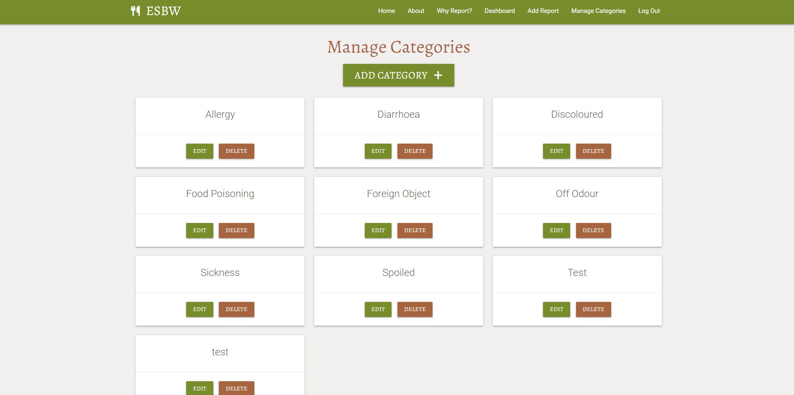

<h2 align="left"></h2>

# Eat Safe - Be Well, a website designed to record and document food safety and quality incidents experienced by consumers.

## Milestone Project 3 - Backend Development

<h2 align="left"></h2>

* Eat Safe - Be well is a website which allows consumers of everyday food items to report, record and document food safety and quality incidents. Incidents may relate to the safety or quality of food including food borne illnesses, the discovery of foreign object or allergic reactions. The website is designed to be fully responsive so that it can be used on any device.

* This is my Milestone Project 3 submission for Code Institute's Diploma in Web Application Development course. My website uses non-relational databases, features full CRUD functionality and is built using technologies that I have learnt including HTML, CSS, JavaScript, Python, Flask and MongoDB.

## Live Project

[View the live project here.](https://eatsafe-bewell.herokuapp.com/get_reports)

## Repository

[Find the project repository here.](https://github.com/PATIAT/eatsafe_bewell)

# Table of Contents

## Contents
- [User experience](#user-experience)
  * [User Stories](#user-stories)
    + [First-time Users](#first-time-users)
    + [Returning Users](#returning-users)
    + [Business Owner](#business-owner)
- [Design](#design)
  + [Overview](#overview)
  + [Colour Scheme](#colour-scheme)
  + [Typography](#typography)
  + [Imagery and Aesthetics](#imagery-and-aesthetics)
  + [Icons](#icons)
  + [Cards](#cards)
- [Wireframes](#wireframes)
- [Features](#features)
  + [Items present on all pages](#items-on-all-pages)
  + [Home (Reports) Page](#home-page)
  + [About Page](#about-page)
  + [Why Report Page](#why-report-page)
  + [Register and Log In Pages](#register-and-log-in-pages)
  + [Dashboard (User's Reports) Page](#dashboard-user's-reports-page)
  + [Add / Edit Report Page](#add-edit-report-page)
  + [Manage Categories Page](#manage-categories-page)
  + [Add / Edit Category Pages](#add-edit-categories-pages)
  + [Delete Report / Category Pages](#delete-report-category-pages)
  + [Error Handling](#error-handling)
- [Future Features](#future-features)
  + [User Experience Features](#user-experience-features)
  + [Development Features](#development-features)
- [Data Model](#data-model)
- [Technologies used](#technologies-used)
  + [Languages Used](#languages-used)
  + [Frameworks Libraries and Programs](#frameworks-libraries-and-programs)
- [Testing](#testing)
- [Deployment](#deployment)
  + [Creating a Gitpod Workspace](#creating-a-gitpod-workspace)
  + [GitHub Pages](#github-pages)
  + [Forking the GitHub Repository](#forking-the-github-repository)
  + [Making a Local Clone](#making-a-local-clone)
  + [Creating an application with Heroku](#creating-an-application-with-heroku)
- [Credits](#credits)
  + [Code](#code)
  + [Media](#media)
  + [Content](#content)
  + [Acknowledgements](#acknowledgements)

# User Experience

## User stories

### First-time Users

*The website users that fall into this category are considering reporting a food safety incident online for the first time.* 

* As a first-time user, I want the landing page of the website to clearly explain the purpose of the website .

* As a first-time user, I want to be able to easily register for an account.

* As a first-time user, I want the website to work on any device.

### Returning Users

*The website users that fall into this category are have previously reported a food safety incident online.* 

* As a returning user, I want to be able to log in to my account.

* As a returning user, I want to be able to create / view / edit / delete my own food safety incident reports.

* As a returning user, I want to be able to view other user’s food safety incident reports.

* As a returning user, I want there to be valid corrective actions that I am able to take based upon my food safety incident report. This may include links to reporting mechanisms which alert potentially unsafe foods to the relevant authorities.

* As a returning user, I want to be able to search for food safety incident reports, to make it quicker to find incidents with a certain word in their name or description.

* As a returning user, I want to be able to access and use the website on any device.

### Buisness Owner

* As the website owner, I want users to be able to create, edit and delete their own reports, but not those of any other users.

* As the website owner, I want the adding, editing and deletion of any of the food safety incident categories to be restricted to users with admin privileges.

* As the business owner, I want it to be as easy as possible for users to submit food safety incident reports. E.g. a simple and quick process while gathering enough meaningful information to be useful to other users.

* As the business owner, I want the website to be effective and look consistently good on any device.

## Design

### Overview

- The website design is professional, yet attractive. The name Eat Safe - Be Well refers to the importance of food safety and food quality. These two food attributes should be a prerequisite for all food that is on sale to consumers. Where this is not found to be the case, a mechanism must exist where consumers can report any such issues, thereby alerting fellow consumers and relevant authorities to potentially unsafe food.

### Colour
<h2 align="left"></h2>

- Eat Safe – Be Well uses a simple colour scheme of pale greens, browns, beiges and whites. The background is white with the nav and footer background being green which contrast well and keep these elements distinguishable from other elements on the page. 

### Typography

- Brand Logos and Headings are in Alegreya with a serif fallback font. This was used as sparingly as possible to maintain maximum impact. The body is in Roboto which is one of the most popular google fonts with sans-serif as a fallback font. Using Roboto means that the text will be easy to read on all device sizes.

### Images

- Images have been used sparingly on the website as the concept of the website does not necessarily lend itself to images. There is a banner image on the home page which is used to give the user an idea of what the website is about.

### Icons

- Icons from Fontawesome have been used on the website's forms and on some of the buttons to emphasise the purpose of these elements.

### Materialize CSS Cards

- I decided to use cards as a way to display the user reports as it offers a clean and concise way to display the data submitted by the user. The cards are reveal cards which allow the user to click to reveal more information, this offers a good solution to prevent the cards from becomming cluttered.

# Wireframes

- [View my wireframes in PDF form here](https://github.com/PATIAT/eatsafe_bewell/blob/main/static/readme/wireframes/eat-safe-be-well-wireframes.png).

# Features

## Items present on all pages

### Nav Bar

<h2 align="left"></h2>
<h2 align="left"></h2>
<h2 align="left"></h2>

- The navigation bar displays differently depending on whether a user is logged in, logged out or whether they are an administrator of the website.

- The background of each link on the website changes colour when the user hovers over them to make them discernably different.

- The brand logo included in the nav bar acts as a link to take users back to the home page.

- On smaller screens, the materialize CSS mobile side nav bar was used and slides out from the left on smaller screens.

### Footer

<h2 align="left"></h2>

- The footer includes a smaller version of the logo along with the tag line.

- The footer also includes links to social media channels for the website which each open in a new browser tab.

### Flash Messages

<h2 align="left"></h2>

- I have used flash messages to confirm to users when an action has been completed, for example, when they have logged in, loggged out, submitted a report, edited a report and deleted a report.

- I have used similar styles for the flash messages so that there is consistency between the main site and any specific messages to ensure consistent user experience.

## Home (Reports) Page

<h2 align="left"></h2>

- This home (reports) page is available to all users and is the landing page, it contains a succinct tag line at the top to give the user an immediate idea of the purpose of the website. 

- There are dynamic features on this page including the button on the jumbotron which changes from "Register Today" to "Inspect Report" depending on whether a user is logged in.

- It also contains a search function which uses keywords from the report title and description to filter the reports below. 

- The reports on this page are from all users and if the user is logged in the "Edit" and "Delete" buttons are present on their reports. 

- The reports are displayed on cards which have a pointer to reveal more information. All of the information from the database is pulled into these cards.

## About Page

<h2 align="left"></h2>

- The about page is available to all users and is intended to give users additional information regarding the purpose of Eat Safe, Be Well as a concept. It contains a card which contains a paragraph, a button which changes from "Register Today" to "Inspect Report" depending on whether a user is logged in. It also contains a responsive image.

## Why Report Page

<h2 align="left"></h2>

- The why report page is available to all users and is intended to emphasise some of the most important reasons why reporting food safety and quality incidents is essential to protect the health and wellbeing of communities. It contains a card which contains a paragraph, a button which changes from "Register Today" to "Inspect Report" depending on whether a user is logged in. It also contains a responsive image.

## Register and Log In Pages

<h2 align="left"></h2>

<h2 align="left"></h2>

- The Register and Log in pages both feature forms, a large button, and a link to the other page in the event that a user is in the wrong place. For example, they're on the Register Page, it says "Already Registered? Log In here."

- The Register form features input fields for Username, First Name, Last Name County and Password. All fields are required.

- The Log in form features input fields for Username and Password. All fields are required.

- All user passwords are hashed for security.

<h2 align="left"></h2>

- Each username must be unique, so when a new user registers, the username they have entered is checked. If it already exists, a flash message informs the user to try another username.

<h2 align="left"></h2>

- If incorrect log in details are provided, a flash message informs the user that the username and / or password is incorrect.

## Dashboard (User's Reports) Page

<h2 align="left"></h2>

- The dashboard page is where the user can submit, view and manage their own reports. 

- The page contains the cards which relate to the users specific reports and therefore they can edit and delete each of the reports on view on this page.

- The users are only able to edit or delete their own reports and not those of other users.

<h2 align="left"></h2>

- If the user has no reports, then a message appears to inform the user.

## Add / Edit Report Page

<h2 align="left"></h2>

<h2 align="left"></h2>

- The submit and edit report pages both feature forms and submit call to action buttons. The edit page also features a cancel button which directs the user back to to their dashboard.

- Input fields include
  - Report name
  - Report product
  - Report brand
  - Report best before date
  - Report category
  - Report symptoms
  - Is the report serious
  - Is the issue reported
  - Report date

- All of the inputs are validated and feature labels to guide users.

- When a user attempts to edit a report, the existing content appears in the relevant input fields.

## Manage Categories Page

<h2 align="left"></h2>

- This page lists all the available categories in alphabetical order. It gives the admin user the option to add, edit or delete categories as they see relevant.

<h2 align="left"></h2>

- This page is only accessible to admin users. If a non-admin is logged in and tries to access this page or tries to access the submit, edit or delete a category pages, they be presented with a flash message telling them they need to have admin priviliges to access this page and they will be redirected to the home (reports) page.

## Add / Edit Category Pages

<h2 align="left"></h2>

<h2 align="left"></h2>

- The add and edit category pages feature a form with a single input field for Category Name and a submit button. The edit page also contains a cancel button.

## Delete Report / Category Pages

<h2 align="left"></h2>

<h2 align="left"></h2>

- If a user clicks on a 'Delete Report' or 'Delete Category', they will be taken to this page to confirm the deletion. This is an extra defensive programming step to prevent users accidentally deleting reports and/or categories.

- There is a cancel button on each page.

## Error Handling

- If an error occurs, the user will be redirected back to the get reports (home) page. Logged out users are also redirected to the get reports page (home) or the login page.

- It is still possible for admin users to add cetegories with identical names. This is a known issue and is included within the unresolved bug section.

# Future Features

## User Experience Features 

### Confirm delete modal rather than a page

- For the defensive programming feature for deletion of reports and categories, I used a separate html template but a modal may be better suited for this functionality. 

### Add a password confirmation input

- Password confirmation will assist users in verifying they haven't made a type error when inputting their password.

### Add edit and deletion functionality

- Edit or delete functionality for user accound would improve user experience.

### Add comments section

- Comments sections could be added to the reports but this would need careful consideration due to the fact that it may become more of a forum if this feature was added.

## Development Features

### Automated Testing

- Automated testing has not been utilised in this project and all testing has been undertaken on a manual basis. It may be worth re-visiting this in the future as code could be refactored to include automated testing.

# Data Model

## Database
- The website is a data-centric website;
- The front-end utilises HTML, Javascript and CSS .
- The backend utilises Python, Flask and Jinja Templates connected with a mongodb document-oriented database.

### Conceptual Database Model
<h2 align="left"></h2>

- To aid with planning the database creation, I started by create a Conceptual Database Model.

### Actual Database Model
<h2 align="left"></h2>

- After completing the Conceptual Database Model, I created an Actual Database Model. This model reflects the structure of the database on MongoDB.

### MongoDB Database
<h2 align="left"></h2>

#### Users Collection
<h2 align="left"></h2>

#### Categories Collection
<h2 align="left"></h2>

#### Reports Collection
<h2 align="left"></h2>

# Technologies Used

## Languages Used

- [HTML5](https://en.wikipedia.org/wiki/HTML5)

- [CSS3](https://en.wikipedia.org/wiki/CSS)

- [JavaScript](https://en.wikipedia.org/wiki/JavaScript)

- [Python](https://en.wikipedia.org/wiki/Python_(programming_language))

## Frameworks Libraries and Programs

- [Heroku](https://id.heroku.com/login)
  - Heroku is the deployment source I used for this project. I'm also using it for the Postgres relational database

- [MongoDB](https://www.mongodb.com/)
    - I'm using MongoDB for my non-relational database.

- [Flask](https://flask.palletsprojects.com/en/2.2.x/templating/)
  - Templating language I've used with Python to add logic to my html templates.

- [Jinja](https://jinja.palletsprojects.com/en/3.0.x/)
  - Templating language I've used with Python to add logic to my html templates.

- [Materialize CSS](https://materializecss.com/)
  - Front-end library with HTML, CSS and Javascript based componants. I used features including Nav bar, Cards, Buttons and Forms.

- [jQuery](https://jquery.com/)
  - I used jQuery to add functionality to MaterialiseCSS componants.

- [Google Fonts](https://fonts.google.com/)
  - Two fonts are imported from google fonts.
  
- [Font awesome](https://fontawesome.com/)
  - I used icons from font awesome on buttons.

- [Git](https://git-scm.com/)
  - Git was used as a version control in the terminal.

- [Github](https://github.com/)
  - Github was used to create and store the project repository.

- [Gitpod](https://gitpod.io/)
  - Gitpod was used to create my files and where I wrote the code.

- [Balsamiq](https://balsamiq.com/)
  - Balsamiq was used to create Wireframes for the project during the initial planning stage.

- [Techsini](https://techsini.com/multi-mockup/)
  - Techsini was used to help check responsiveness and take screenshots of the page at different screen sizes.

- [TinyPNG](https://tinypng.com/)
  - TinyPNG was used to compress images for a faster loading time.

- [WebFormatter](https://webformatter.com/html)
  - WebFormatter was used to help beautify the code.

- [Google Chrome Dev Tools](https://developer.chrome.com/docs/devtools/)
  - Google Chrome's Dev Tools were used while building the project to test responsiveness and for debugging.

# Testing

- Please refer [here](https://github.com/PATIAT/eatsafe_bewell/blob/main/TESTING.md) for more information on testing.

# Deployment

## Creating a Gitpod Workspace

The project was created in Gitpod using the Code Institute Gitpod Full Template using these steps:

1. Log in to GitHub and go to the [Code Institute student template for Gitpod](https://github.com/Code-Institute-Org/gitpod-full-template)
2. Click 'Use this Template' next to the Green Gitpod button.
3. Add a repository name and click 'Create reposiory from template'.
4. This will create a copy of the template in your own repository. Now you can click the green 'Gitpod' button to open a workspace in Gitpod.

## Forking the GitHub Repository

Forks are used to propose changes to someone else's project or to use someone else's project as a starting point for your own idea. By forking the GitHub Repository you make a copy of the original repository on our GitHub account to view and/or make changes without affecting the original repository.

To Fork a Github Repository:

1. Log in to GitHub and go to the [GitHub Repository](https://github.com/PATIAT/eatsafe_bewell)
2. Locate the Fork button in the top-right corner of the page, click Fork.
3. You should now have a copy of the original repository in your GitHub account.

## Making a Local Clone

You will now have a fork of the repository, but you don't have the files in that repository locally on your computer.

To make a local clone:

1. Log in to GitHub and go to the [GitHub Repository](https://github.com/PATIAT/eatsafe_bewell)
2. Above the list of files, click  Code.
3. To clone the repository using HTTPS, under "Clone with HTTPS", click the 'Copy' icon. To clone the repository using an SSH key, including a certificate issued by your organization's SSH certificate authority, click Use SSH, then click the 'Copy' icon. To clone a repository using GitHub CLI, click Use GitHub CLI, then click the 'Copy' icon.
4. Open Git Bash.
5. Change the current working directory to the location where you want the cloned directory.
6. Type git clone, and then paste the URL you copied earlier. It will look like this, with your GitHub AE username instead of YOUR-USERNAME:

```
$ git clone https://github.com/YOUR-USERNAME/YOUR-REPOSITORY
```

7. Press Enter. Your local clone will be created.

```
$ git clone https://github.com/YOUR-USERNAME/YOUR-REPOSITORY
> Cloning into `eatsafe_bewell`...
> remote: Counting objects: 10, done.
> remote: Compressing objects: 100% (8/8), done.
> remove: Total 10 (delta 1), reused 10 (delta 1)
> Unpacking objects: 100% (10/10), done.
```

8. Create an env.py file in the root folder in the project, and add the following code with the relevant key, value pairs, and ensure you enter the correct key values.
(You can use [RandomKeygen](https://randomkeygen.com/) to generate a "Fort Knox" password for the "SECRET_KEY" field)

<code>import os</code><br>
<code>os.environ.setdefault("IP", 0.0.0.0)</code><br>
<code>os.environ.setdefault("PORT", 5000)</code><br>
<code>os.environ.setdefault("SECRET_KEY", TO BE ADDED BY USER)</code><br>
<code>os.environ.setdefault("MONGO_URI", TO BE ADDED BY USER)</code><br>
<code>os.environ.setdefault("MONGO_DBNAME", TO BE ADDED BY USER)</code><br>

9. Install the relevant packages as per the requirements.txt file
10. Start the application by running <code>python3 app.py</code>

Click [Here](https://docs.github.com/en/github-ae@latest/get-started/quickstart/fork-a-repo) for the GitHub quick start guide with images and more detailed explanations of the above process.

## MongoDB Database

Mongodb is the database used in the application
1. Create a [MongoDB](https://account.mongodb.com/account/register) account.
2. Create a New Cluster.
3. Select "Shared", for "Cloud Provider & Region" select "AWS" and your closed location.
4. Leave "Cluster Tier" on "M0 Sandbox".
5. Leave "Additional Settings" on "MongoDB 5.0, No Backup"
6. Set "Cluster Name" to the name you would like (One time only: once your cluster is created, you won't be able to change its name.)
7. Select "Create Cluster"
8. Click the Cluster Name, navigate to Collections.
9. Select "Create Database".
10. Name the database "eatsafe_bewell" and the first collection "users".
11. Create another collection called "reports", by clicking the "+" icon next to "eatsafe_bewell".
12. Click Database Access.
13. Create a new user, set a username (Make a note of the username) and password.
14. Set the "Database User Privileges" - "Built-in Role" to "Read and write to any database".
15. Select "Add User".
16. Select "Network Access", select "Add IP Address", add the IP Address of the application connecting to the database and select "Confirm".
17. Click Database, click Connect, and click connect your application.
18. Select your "Driver and "Version". copy the code to your env.py file after '"MONGO_URI":' (Replace the "password" with the password for the user and add "eatsafe_bewell after "mongobd.net/"). Click Close.

## Heroku
1. In the app.py file, ensure that debug is set to False.
2. Create a new file called "ProcFile" in the root directory, and add the line; 

<code>web: python app.py</code>

3. Create a requirements.txt file by running the below command in the terminal.

<code>pip freeze > requirements.txt</code>

5. Ensure ProcFile and requirements.txt are committed to your git repository in the root directory.
6. Create an account on [Heroku](https://dashboard.heroku.com/apps)
7. On your dashboard, select "Create New App".
8. Set a unique name and select the closest region to you. Select "Create App".
9. In Application Dashboard, navigate to the deploy section and connect to your Git account,then to your Repository. Select "Connect" (After connecting the section should look like the image below).
10. Navigate to the "Settings" tab.
11. Select "Reveal Config Vars" and set key/value pairs from env.py IP, MONGO_DBNAME, MONGO_URI, PORT, SECRET_KEY.
12. Navigate back to the "Deploy" tab.
13. Select your branch then "Enable Automatic Deploys".
14. When the deployment has been successful, click on "Open App" in the top-right.

# Credits

## Code

- I used Materalize CSS throughout the project, particularly for the nav bar, cards, search bar, buttons and forms. 

- I referred to the lessons from the Code Institute's LMS and used the Task Manager Project for the User Authentication and Search fynctionality.

Code Institute: I referred to lessons and source code from Code Institute's Web Application Development course. I sourced the User Authentication and Search bar functionality from the Task Manager Walk Through Project.

## Content

- [Food Standards Agency](https://www.food.gov.uk/): I used the FSA website for inspiration for the types of things the reports should include but I also drew from my knowledge of working as a Food Safety Compliance Manager within the food manufacturing industry.

## Media

- The images used on the website were sourced from:
  - Photo by Askar Abayev: https://www.pexels.com/photo/family-doing-a-thanksgiving-toasts-5638751/ 
  - Photo by Edward Jenner: https://www.pexels.com/photo/man-looking-through-a-microscope-4033151/
  - Photo by Viktoria Slowikowska: https://www.pexels.com/photo/fresh-vegetables-on-the-table-5677717/

## Acknowledgements

- Thank you to my Code Institute Mentor, Chris Quinn for his advice and guidance as always.

- Please note this is a personal project. This website is purely for the sake of the developer's portfolio and not for public consumption.

Paul Trotter (PATIAT), 2023.