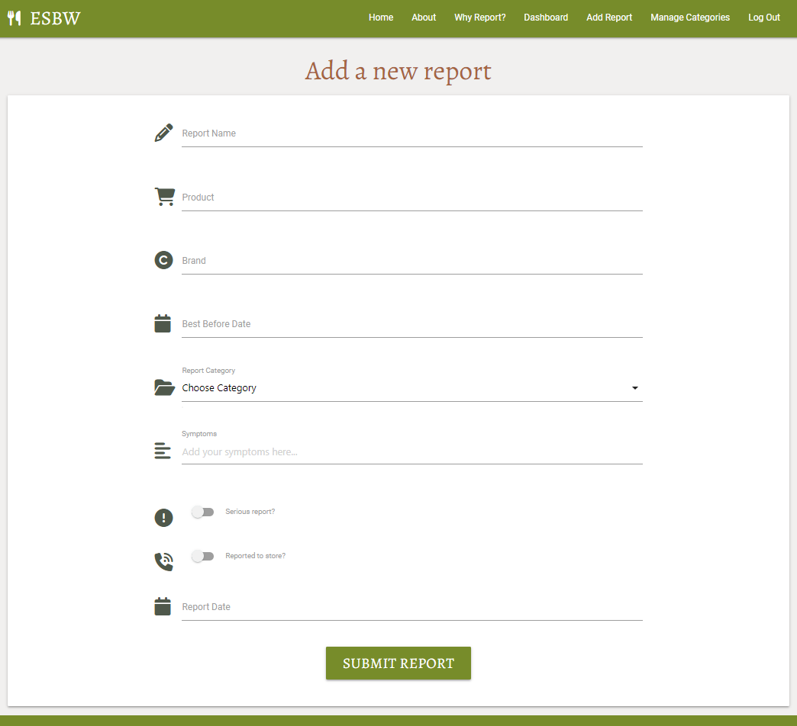

# Testing

The Eat Safe Be Well website has been tested using the following methods:

- [Code Validation](#code-validation)
    - [W3C HTML Validator](#w3c-html-validator) 
    - [W3C CSS Validator](#w3c-css-validator)
    - [JSHINT Javascript Code Quality Tool](#jshint-javascript-code-quality-tool)
    - [Python Validation using Gitpod](python-validation-using-gitpod)
- [A11y Color Contrast Accessibility Checker](#a11y-color-contrast-accessibility-checker)
- [Wave Webaim Accessibility Checker](#wave-webaim-accessibility-checker)
- [Lighthouse](#lighthouse)
- [Responsiveness](#responsiveness)
- [Browser Compatibility](#browser-compatibility)
- [Testing User Stories](#testing-user-stories)
    - [First Time User](#first-time-user)
    - [Returning User](#returning-user)
    - [Business Owner](#business-owner)
- [Manual Testing](#manual-testing)
- [Automated Testing](#automated-testing)
- [Peer Review](#peer-review)
- [Bugs](#bugs)
    - [Resolved](#resolved)
    - [Unresolved](#unresolved)

# Code Validation

## W3C HTML Validator

### Home Page

<h2 align="left"></h2>

- The Eat Safe Be Well website landing page passed all tests using the [W3C HTML](https://validator.w3.org/) Validator tool

## W3C CSS Validator

### style.css file

<h2 align="left"></h2>

- The Eat Safe Be Well website passed all tests using the [W3C CSS](https://jigsaw.w3.org/css-validator/) Validator tool

## JSHINT Javascript Code Quality Tool

### script.js file

<h2 align="left"></h2>

- The Eat Safe Be Well website passed all tests using the [JSHint](https://jshint.com/) Validator tool

## Python Validation using Gitpod

<h2 align="left"></h2>
<h2 align="left"></h2>

- The Eat Safe Be Well website python code was validated by using GitPod and the Code Institute Python Linter

# A11y Color Contrast Accessibility Checker

### Home Page

<h2 align="left"></h2>

- The home page was tested using the [A11y Color Contrast Accessibility Checker](https://color.a11y.com/) and no colour contrast issues were found. The same colour palette is used across the entire site.

# Wave Webaim Accessibility Checker

<h2 align="left"></h2>

- The home page was tested using the [Wave Webaim](https://wave.webaim.org/) accessibility checker.
- One error was found and relates to an empty anchor element which contains no text but is intended to trigger the mobile menu.

# Lighthouse

I used the Lighthouse reports in Google Developer Tools to examine the pages of the website for the following
- Performace
- Accessibility
- Best Practices 
- SEO

### Home Page

#### Desktop
<h2 align="left"></h2>

#### Mobile
<h2 align="left"></h2>

### About Page

#### Desktop
<h2 align="left"></h2>

#### Mobile
<h2 align="left"></h2>

### Why Report Page

#### Desktop
<h2 align="left"></h2>

#### Mobile
<h2 align="left"></h2>

### Register Page

#### Desktop
<h2 align="left"></h2>

#### Mobile
<h2 align="left"></h2>

### Login Page

#### Desktop
<h2 align="left"></h2>

#### Mobile
<h2 align="left"></h2>

### Dashboard Page

#### Desktop
<h2 align="left"></h2>

#### Mobile
<h2 align="left"></h2>

### Add Report Page

#### Desktop
<h2 align="left"></h2>

#### Mobile
<h2 align="left"></h2>

### Edit Report Page

#### Desktop
<h2 align="left"></h2>

#### Mobile
<h2 align="left"></h2>

### Delete Report Page

#### Desktop
<h2 align="left"></h2>

#### Mobile
<h2 align="left"></h2>

### Manage Categories Page

#### Desktop
<h2 align="left"></h2>

#### Mobile
<h2 align="left"></h2>

### Add Category Page

#### Desktop
<h2 align="left"></h2>

#### Mobile
<h2 align="left"></h2>

### Edit Category Page

#### Desktop
<h2 align="left"></h2>

#### Mobile
<h2 align="left"></h2>

### Delete Category Page

#### Desktop
<h2 align="left"></h2>

#### Mobile
<h2 align="left"></h2>

- In instances where performance was marked down, it was due to the following:

  - Eliminate render-blocking resources
  - Reduce unused JavaScript
  - Preload Largest Contentful Paint image
  - Reduce unused CSS

- In future all of these suggestions will be considered during development.

- In instances where accessibility was marked down, it was due to the following:

  - Background and foreground colors do not have a sufficient contrast ratio.
  - Heading elements are not in a sequentially-descending order.
  - Form elements do not have associated labels (this is where the category dropdown is used but is not an input/label)
  
- In future, lighthouse could be used to identify these types of issues earlier in the development process.

# Browser Compatibility

The site was tested in Google Chrome, Microsoft Edge and Mozilla Firefox on desktop.

The site was tested in Google Chrome and Safari on mobile and tablet.

No issues arose during browser testing.

# Responsiveness

Responsivity tests were carried out using Google Chrome DevTools. Device screen sizes covered include:

- iPhone SE
- iPhone XR
- iPhone 12 Pro
- Pixel 5
- Samsung Galaxy S8+
- Samsung Galaxy S20 Ultra
- iPad Mini
- iPad Air
- Surface Pro 7
- Surface Duo
- Galaxy Fold
- Samsung Galaxy A51/71
- Nest Hub
- Nest Hub Max

I also personally tested the website on iPhone 11, iPhone 13 Pro, iPhone SE 2022, HP Laptop, HP 27 All-in-One and a MacBook Air 2015.

# Testing User Stories

### First-time Users

* As a first-time user, I want the landing page of the website to clearly explain the purpose of the website .
    - The landing page has a clear message of the purpose of the website with a call to action which is prominant. 

* As a first-time user, I want to be able to easily register for an account.
    - The main call to action is to register, there is also an option for this on the navbar.

    <h2 align="left"></h2>

* As a first-time user, I want the website to work on any device.
    - The website is fully responsive on all device sizes as demonstrated by this testing.

    <h2 align="left"></h2>

### Returning Users

* As a returning user, I want to be able to log in to my account.
    - There is a prominant log in option on the navbar which is easy to see and use.

    <h2 align="left"></h2>
    <h2 align="left"></h2>

* As a returning user, I want to be able to create / view / edit / delete my own food safety incident reports.
    - Once logged in, users can create new reports, view theirs and other user's reports, edit their own reports only and delete their own reports only.

    <h2 align="left"></h2>

* As a returning user, I want to be able to view other user’s food safety incident reports.
    - On the main home page, reports from all user accounts are displayed but the edit and delete buttons appear for only the users own reports.

    <h2 align="left"></h2>

* As a returning user, I want there to be valid corrective actions that I am able to take based upon my food safety incident report. This may include links to reporting mechanisms which alert potentially unsafe foods to the relevant authorities.
    - This has not been acheived, primarily down to workload and deadline concerns.

* As a returning user, I want to be able to search for food safety incident reports, to make it quicker to find incidents with a certain word in their name or description.
    - The main homepage features a search function whereby the users can use text to search the report name and description.
    
    <h2 align="left"></h2>
    
* As a returning user, I want to be able to access and use the website on any device.
    - The website is responsive and works well on all device screen sizes.

    <h2 align="left"></h2>

### Buisness Owner

<h2 align="left"></h2>

* As the website owner, I want users to be able to create, edit and delete their own reports, but not those of any other users.
    - This is acheivable for users once they have registered, they have full CRUD functionality.

    <h2 align="left"></h2>

* As the website owner, I want the adding, editing and deletion of any of the food safety incident categories to be restricted to users with admin privileges.
    - Only admin users can add, edit or delete categories. This is facilitated by verifying that the user is "admin" before allowing access to these pages.

* As the business owner, I want it to be as easy as possible for users to submit food safety incident reports. E.g. a simple and quick process while gathering enough meaningful information to be useful to other users.
    - The form to submit and edit reports are as simplistic as possible with a clean aesthetic to facilitate easy use.

* As the business owner, I want the website to be effective and look consistently good on any device.
    - The design and colour scheme are consistent throughout the site. Additionally a lot of the same elements were re-used and re-styled e.g. cards.

# Manual Testing

## Nav Bar

<h2 align="left"></h2>

- The main site navigation buttons have been tested and have been verified as functional.
- Priviliges of two types of user have been tested and have been verified as working correctly and as expected.

## Footer

<h2 align="left"></h2>

- The hyperlinks to site social channels have been tested and have been verified as working correctly and as expected.
- Each link opens on a new tab.

## Flash Messages

<h2 align="left"></h2>

- Flash messages have been tested in all scenarios and have been verified as working correctly and as expected.

## Home Page

<h2 align="left"></h2>

- The search function and buttons have been tested and have been verified as working correctly and as expected.
- The dynamic button (user permissions) has been tested and has been verified as working correctly and as expected.

## Register / Log In Pages

<h2 align="left"></h2>
<h2 align="left"></h2>

- The form input fields on both forms, including validation have been tested and have been verified as working correctly and as expected.
- The buttons on both forms have been tested and have been verified as working correctly and as expected.
- The hyperlinks to each page have been tested and have been verified as working correctly and as expected.

## About Page

<h2 align="left"></h2>

- The dynamic button (user permissions) has been tested and has been verified as working correctly and as expected.
- The image is responsive on all screen sizes.

## Why Report Page

<h2 align="left"></h2>

- The dynamic button (user permissions) has been tested and has been verified as working correctly and as expected.
- The image is responsive on all screen sizes.

## Dashboard Page

<h2 align="left"></h2>

- The buttons have been tested and have been verified as working correctly and as expected.
- If the user has no reports on their account, a message appears to tell them there is nothing to display. This is the expected behaviour.
- The page only displays the logged in user's reports and not those of other user's.
- I have tested to try and acccess this page as a user that is not admin, I was redirected to this page still as the admin user with the admin user's reports present.

## Submit / Edit Report Pages

<h2 align="left"></h2>
<h2 align="left"></h2>

- The form input fields on both forms, including validation have been tested and have been verified as working correctly and as expected.
- The buttons on both forms have been tested and have been verified as working correctly and as expected.

## Delete Report Page

<h2 align="left"></h2>

- The buttons have been tested and have been verified as working correctly and as expected.

## Manage Categories Page 

<h2 align="left"></h2>

- The buttons have been tested and have been verified as working correctly and as expected.
- I attempted to access this page as a non-admin user and was not allowed access. Instead a flash message appeared telling me I needed admin priviliges.

## Add / Edit Category Pages

<h2 align="left"></h2>
<h2 align="left"></h2>

- The buttons have been tested and have been verified as working correctly and as expected.

## Delete Category Page

<h2 align="left"></h2>>

- The buttons have been tested and have been verified as working correctly and as expected.

# Automated Testing

- I have not included automated testing as part of this project but intend to use it in Module 4.

# Peer Review

- In the final stages of the project, I submitted the site for Peer Review by fellow students and alumni at Code Institute via Slack.

- Comment 1
- Comment 2
- Comment 3

# Bugs

## Resolved

- Issue: base.html - brand logo <i> overlapping text on small screens.
- Fix: added code to remove <i> on smaller screens only using MCSS.

- Issue: run.py - function only showed the users username and no other info on page as per CI project.
- Fix: updated dashboard() function to look up session user's reports so they can be displayed to their own dashboard.

- Issue: dashboard.html and reports.html - buttons were overlapping on small screen sizes only.
- Fix: used the MCSS class btn-flat which resolved the issue.

- Issue: during the mid-point project call, my Tutor suggested amending the background colour to an off-white to allow the cards to be more visible. 
- Fix: This was adopted and rather than rgba(255, 255, 255, 1), rgba(217, 214, 210, 0.35) was used.

- Issue: When logged out I attempted to access the get_categories page where the admin user only should be allowed to add, edit or delete categories. I was able to access the page while logged out by overwriting the URL.
- Fix: In run.py, I added an is_admin function which checks whether a user has admin permissions. This was then used to check if a user has admin as their username when trying to access the get_categories page. If they do not, a flash message appears to tell them only admin users can access this section of the website

## Unresolved

- It is possible to access the add_report page when not logged in but reports cannot be submitted to the database. Further defensive programming is required to prevent this.
- It is possible to access the edit_report page when not logged in provided the report id is available to a logged out user which is unlikely. Again, further defensive programming is required to prevent this.
- It is possible to access the delete_report page when not logged in provided the report id is available to a logged out user which is unlikely. Again, further defensive programming is required to prevent this.
- It is still possible for admin users to add cetegories with identical names.

- *These issues were identified during the testing of the project which was undertaken towards the end. Unfortunaley this was very close to the submission deadline so I have not been able to resolve all issues. In future, I intend to adopt both automated and manual testing and use this throughout the entirety of the development so issues are not left until there is too little time to resolve them.*

<h2 align="left"></h2>

Back to [README.md](/README.md#testing)

